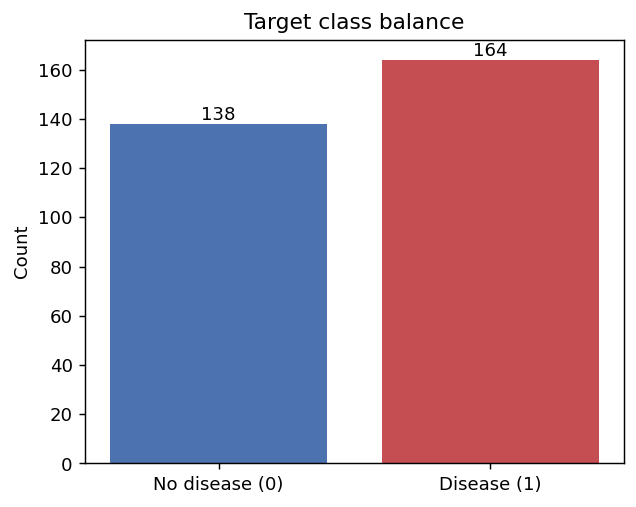
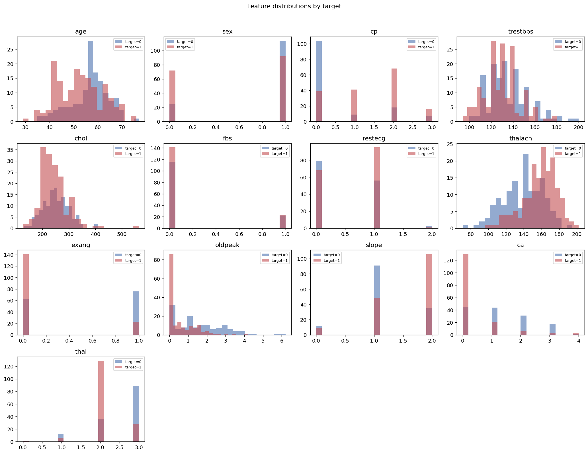
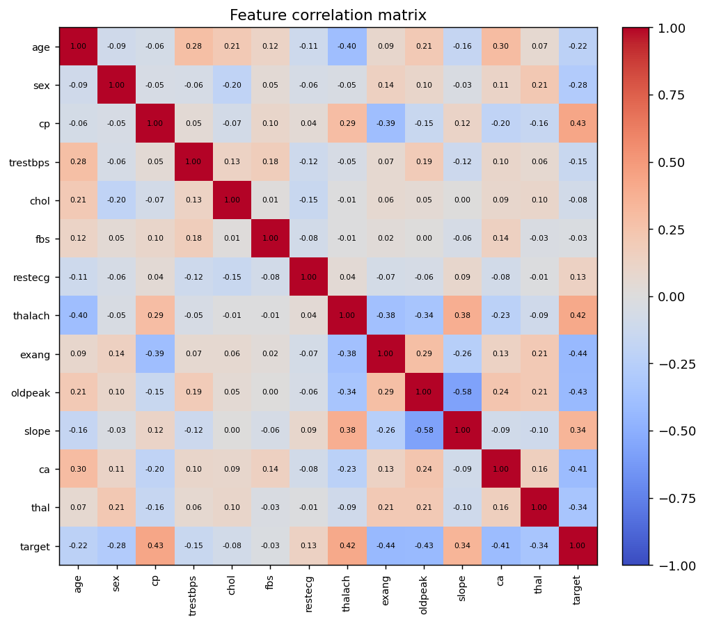
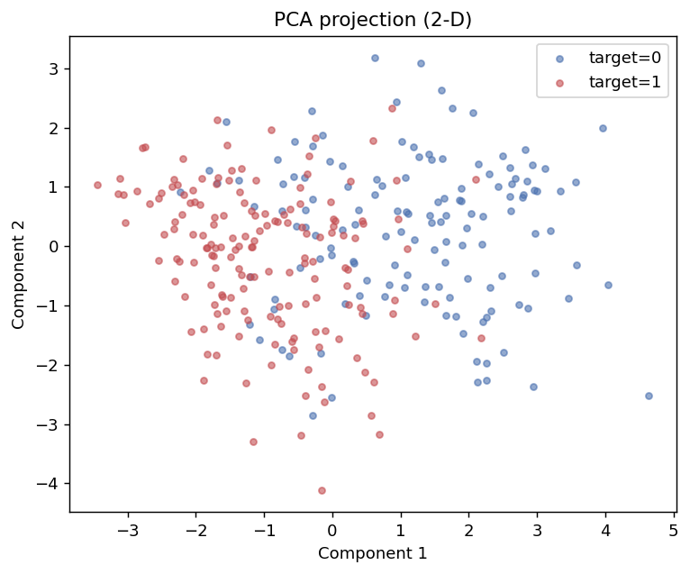
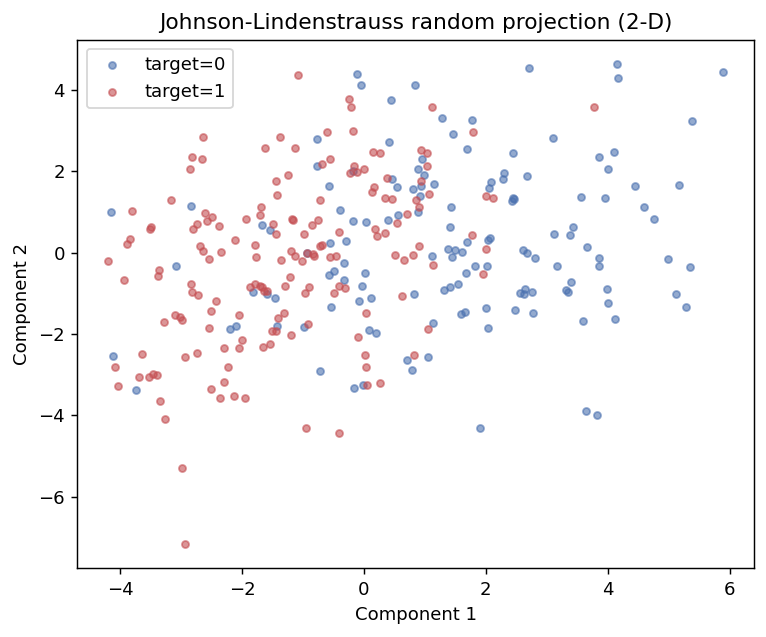

# 1. תיאור המאגר וניתוח חוקר (EDA)

## 1.1 מקור המאגר

- **מקור:** Kaggle — [`johnsmith88/heart-disease-dataset`](https://www.kaggle.com/datasets/johnsmith88/heart-disease-dataset)
- **רקע:** המאגר נגזר ממאגר ה-UCI Cleveland הקלאסי (1988). הוא כולל 14 מתוך 76 המאפיינים המקוריים.
- **משימה:** סיווג בינארי — `target = 1` (קיימת מחלת לב) מול `target = 0` (אין מחלה).

## 1.2 המאפיינים

| מאפיין | תיאור | סוג |
|--------|-------|-----|
| `age` | גיל (שנים) | רציף |
| `sex` | מין (1=זכר, 0=נקבה) | בינארי |
| `cp` | סוג כאב בחזה (0–3) | קטגוריאלי |
| `trestbps` | לחץ דם במנוחה (mm Hg) | רציף |
| `chol` | כולסטרול בסרום (mg/dl) | רציף |
| `fbs` | סוכר בצום > 120 mg/dl (1/0) | בינארי |
| `restecg` | תוצאת ECG במנוחה (0–2) | קטגוריאלי |
| `thalach` | דופק מרבי שהושג | רציף |
| `exang` | אנגינה מאומץ (1/0) | בינארי |
| `oldpeak` | ירידת ST מאומץ ביחס למנוחה | רציף |
| `slope` | שיפוע מקטע ST בשיא המאמץ (0–2) | קטגוריאלי |
| `ca` | מספר כלי דם ראשיים שנצבעו (0–4) | קטגוריאלי |
| `thal` | תלסמיה (0–3) | קטגוריאלי |
| `target` | **תווית:** מחלת לב קיימת (1) / לא (0) | בינארי |

## 1.3 מאפייני המאגר (לאחר טעינה)

| מדד | ערך |
|-----|-----|
| שורות גולמיות | **1025** |
| שורות ייחודיות | **302** |
| שורות כפולות | **723** |
| ערכים חסרים | **0** |
| איזון מחלקות (ייחודיות) | 164 חולים / 138 בריאים |

המאגר **מאוזן** למדי (≈54% חולים), כך שדיוק (accuracy) הוא מדד סביר, אך נדווח גם על
precision/recall/F1/AUC.

## 1.4 התפלגות התווית

## 1.5 התפלגות המאפיינים לפי התווית

היסטוגרמות לכל מאפיין, מופרדות לפי חולים/בריאים. ניכר הבדל ברור במאפיינים כמו `cp`,
`thalach`, `oldpeak`, `exang` ו-`ca`.

## 1.6 מטריצת מתאמים

מאפיינים בעלי מתאם חיובי בולט עם התווית: `cp`, `thalach`, `slope`. מאפיינים בעלי מתאם
שלילי בולט: `oldpeak`, `exang`, `ca`, `thal`, `sex`.

## 1.7 הפחתת ממד לוויזואליזציה (הרצאה 15)

השלכנו את 13 המאפיינים לדו-ממד בשתי שיטות שמומשו מאפס: **PCA** (באמצעות SVD) ו-**היטל
אקראי של Johnson–Lindenstrauss**. שתיהן מראות הפרדה חלקית בין שתי הקבוצות — סימן שהבעיה
ניתנת ללמידה אך אינה ניתנת להפרדה לינארית מושלמת.

| PCA | Johnson–Lindenstrauss |
|-----|------------------------|
|  |  |

## 1.8 בעיית הכפילויות (קריטי!)

המאגר בגרסת Kaggle הוא מאגר ה-303 שורות המקורי ש**הוכפל** ל-1025 שורות. כלומר 723 שורות
הן עותקים מדויקים. עובדה זו היא לב האתגר בפרויקט והיא נדונה בהרחבה בקובץ
[05_challenges.md](05_challenges.md). בקצרה: פיצול אקראי על הנתונים הגולמיים מציב עותקים
זהים גם ב-train וגם ב-test, וגורם למודלים "משננים" להגיע לדיוק מנופח של עד 100%.
**כל ההערכה בפרויקט מתבצעת על 302 השורות הייחודיות בלבד.**
