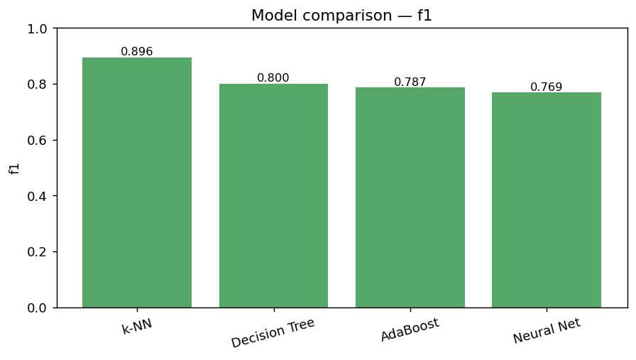
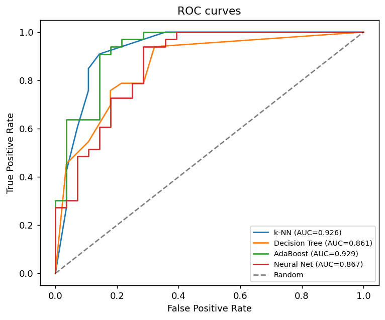
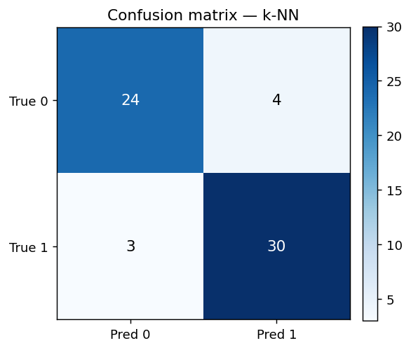

# 4. תוצאות

כל התוצאות מחושבות על **302 השורות הייחודיות** (ללא כפילויות), בפיצול 80/20 עם זרע קבוע
(`seed=42`). היפר-הפרמטרים נבחרו ב-5-fold CV: $k=11$, `max_depth=5`, `n_estimators=10`.

## 4.1 שאלת מחקר 1 — האם ניתן לחזות מחלת לב?

**כן.** כל ארבעת המודלים עוברים משמעותית את קו הבסיס האקראי (דיוק 0.5), בטווח דיוק של
0.75–0.885 ו-AUC של 0.86–0.93. קיים אות חזק בנתונים שמאפשר חיזוי שימושי.

## 4.2 שאלת מחקר 2 — השוואת מודלים

| מודל | Accuracy | Precision | Recall | F1 | AUC |
|------|:--------:|:---------:|:------:|:----:|:----:|
| **k-NN** ($k=11$) | **0.885** | 0.882 | **0.909** | **0.896** | 0.926 |
| עץ החלטה (`depth=5`) | 0.787 | 0.812 | 0.788 | 0.800 | 0.861 |
| AdaBoost ($T=10$) | 0.787 | 0.857 | 0.727 | 0.787 | **0.929** |
| רשת נוירונים | 0.754 | 0.781 | 0.758 | 0.769 | 0.867 |

**מסקנות:**
- **k-NN הוא המודל המוביל** בדיוק (0.885), ב-recall (0.909) וב-F1 (0.896). על מאגר קטן,
  מאוזן ומתוקנן — שיטה מבוססת-מרחק פשוטה מתפקדת מצוין.
- **ל-AdaBoost ה-AUC הגבוה ביותר (0.929)** — כלומר דירוג ההסתברויות שלו מצוין, גם אם
  סף 0.5 פוגע מעט ב-recall שלו (0.727).
- רשת הנוירונים מעט מאחור — צפוי על מאגר כה קטן (241 דגימות אימון), שבו למודל פרמטרי
  עשיר קל יותר לבצע התאמת יתר.

### גרפים

| השוואת דיוק | השוואת F1 |
|:-----------:|:---------:|
|  |  |

**עקומות ROC:**

**מטריצת הבלבול של המודל המוביל (k-NN):**

## 4.3 שאלת מחקר 3 — חשיבות מאפיינים

חשיבות מנורמלת לכל מודל (עצים/AdaBoost — חשיבות פנימית; k-NN/רשת — permutation), ועמודת
ממוצע (`mean`) כמדד הסכמה:

| מאפיין | עץ החלטה | AdaBoost | k-NN (perm) | רשת (perm) | ממוצע |
|--------|:--------:|:--------:|:-----------:|:----------:|:-----:|
| `cp` (כאב בחזה) | 0.292 | 0.190 | 0.134 | 0.126 | **0.186** |
| `ca` (כלי דם) | 0.145 | 0.154 | 0.165 | 0.109 | **0.143** |
| `sex` (מין) | 0.082 | 0.107 | 0.082 | 0.132 | **0.101** |
| `thal` (תלסמיה) | 0.069 | 0.062 | 0.130 | 0.063 | 0.081 |
| `oldpeak` | 0.084 | 0.000 | 0.087 | 0.098 | 0.067 |
| `thalach` (דופק מרבי) | 0.042 | 0.062 | 0.087 | −0.006 | 0.046 |
| `chol` (כולסטרול) | 0.072 | 0.065 | 0.039 | −0.011 | 0.041 |
| `trestbps` (לחץ דם) | 0.057 | 0.091 | 0.039 | −0.069 | 0.030 |
| `age` (גיל) | 0.068 | 0.074 | 0.056 | −0.092 | 0.027 |
| `slope` | 0.089 | 0.143 | −0.009 | −0.121 | 0.026 |

**מסקנות:**
- **קיימת הסכמה חלקית אך ברורה** בין המודלים: המאפיינים **`cp`, `ca`, `sex`, `thal`,
  `oldpeak`** מדורגים גבוה כמעט בכל השיטות. ל-`cp` (סוג כאב בחזה) ול-`ca` (מספר כלי דם
  ראשיים) ההשפעה החזקה ביותר — תוצאה ההגיונית קלינית.
- מאפיינים כמו `fbs`, `restecg` ו-`exang` תורמים מעט מאוד — חלקם אף שליליים בשיטת
  ה-permutation (כלומר ערבובם אינו מזיק, ולעיתים אף "עוזר" — סימן לרעש).
- מעניין: `age` ו-`chol`, שאינטואיטיבית נתפסים כחשובים, מדורגים בינוני-נמוך — תזכורת
  שאינטואיציה קלינית אינה תמיד תואמת את כוח הניבוי במאגר נתון.

## 4.4 עקומות תיקוף ולמידה

| בחירת $k$ ל-k-NN | עומק העץ (bias–variance) |
|:---------------:|:------------------------:|
|  |  |

| שגיאת אימון של AdaBoost | אובדן אימון של הרשת |
|:----------------------:|:-------------------:|
|  |  |

עקומת עומק העץ ממחישה את עקרון ה-PAC/VC: ה-train מתקרב לדיוק מושלם עם העומק, בעוד
ה-validation מגיע לשיא סביב עומק 5 ואז יורד — התאמת יתר.
