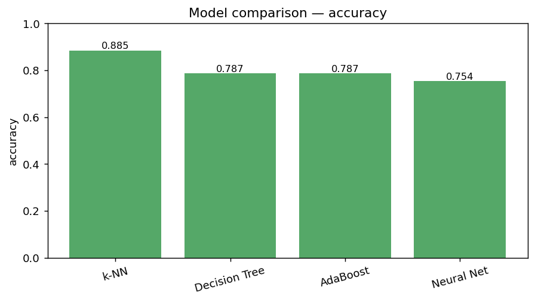
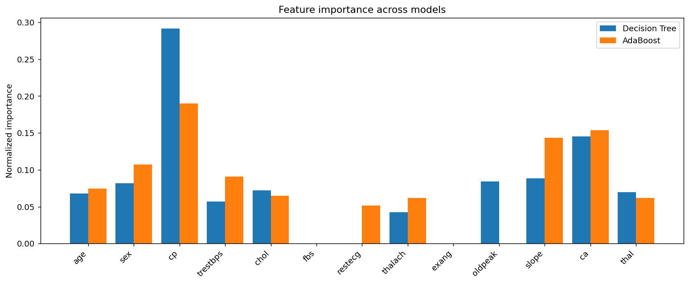
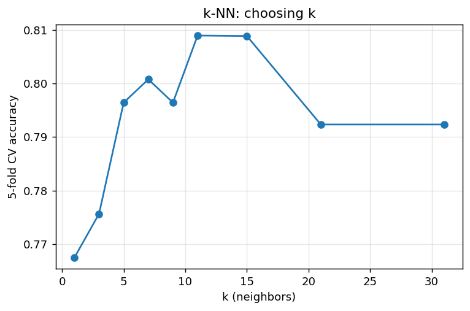
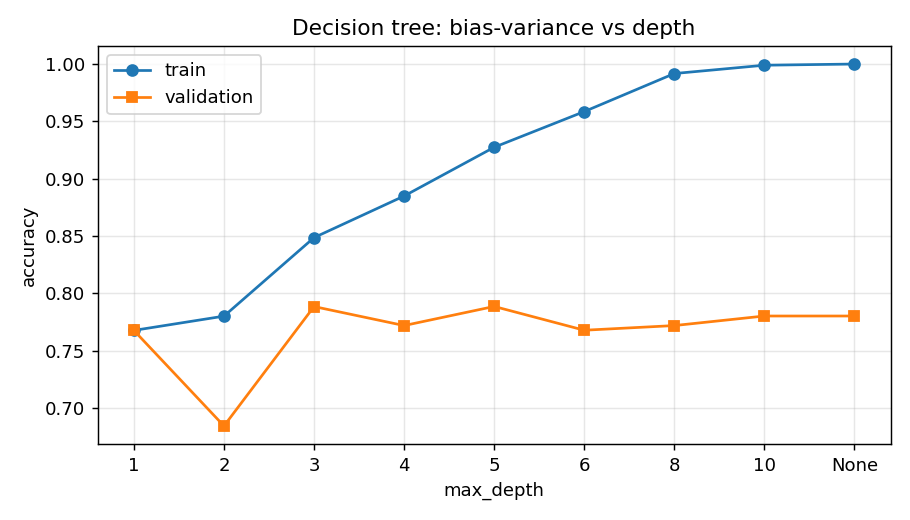
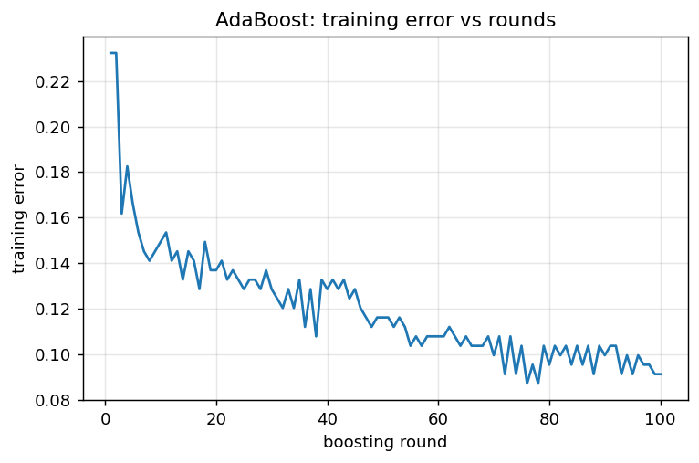
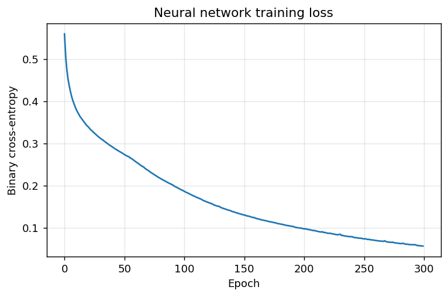

# 4. תוצאות

כל התוצאות מחושבות על **302 השורות הייחודיות** (ללא כפילויות), בפיצול 80/20 עם זרע קבוע
(`seed=42`). היפר-הפרמטרים נבחרו ב-5-fold CV: $k=11$, `max_depth=5`, `n_estimators=10`.

## 4.1 שאלת מחקר 1 — האם ניתן לחזות מחלת לב?

**כן.** כל ארבעת המודלים עוברים משמעותית את קו הבסיס האקראי (דיוק 0.5), בטווח דיוק של
0.75–0.885. קיים אות חזק בנתונים שמאפשר חיזוי שימושי.

## 4.2 שאלת מחקר 2 — השוואת מודלים

| מודל | Accuracy |
|------|:--------:|
| **k-NN** ($k=11$) | **0.885** |
| עץ החלטה (`depth=5`) | 0.787 |
| AdaBoost ($T=10$) | 0.787 |
| רשת נוירונים | 0.754 |

**מסקנות:**
- **k-NN הוא המודל המוביל** בדיוק (0.885). על מאגר קטן, מאוזן ומתוקנן — שיטה מבוססת-מרחק
  פשוטה מתפקדת מצוין.
- **עץ ההחלטה ו-AdaBoost** מגיעים לדיוק זהה (0.787). עבור AdaBoost, תיקוף צולב בחר מספר
  סבבים קטן ($T=10$) — מעבר לכך אין שיפור בתיקוף.
- **רשת הנוירונים (0.754)** מעט מאחור — צפוי על מאגר אימון קטן (241 דגימות), שבו למודל
  פרמטרי עשיר קל יותר לבצע התאמת יתר.
- הפער בין k-NN לשאר המודלים עקבי, ומצביע על כך שמבנה השכנוּת המקומי במרחב המאפיינים
  אינפורמטיבי במיוחד עבור מאגר זה.

### גרפים

**השוואת דיוק בין המודלים:**

## 4.3 שאלת מחקר 3 — חשיבות מאפיינים

חשיבות מנורמלת לכל מודל (חשיבות פנימית: ירידת אי-טוהר בעץ, וסכום $|\alpha_t|$ ב-AdaBoost),
ועמודת ממוצע (`mean`) כמדד הסכמה:

| מאפיין | עץ החלטה | AdaBoost | ממוצע |
|--------|:--------:|:--------:|:-----:|
| `cp` (כאב בחזה) | 0.292 | 0.190 | **0.241** |
| `ca` (כלי דם) | 0.145 | 0.154 | **0.150** |
| `slope` (שיפוע ST) | 0.089 | 0.143 | **0.116** |
| `sex` (מין) | 0.082 | 0.107 | **0.094** |
| `trestbps` (לחץ דם) | 0.057 | 0.091 | 0.074 |
| `age` (גיל) | 0.068 | 0.074 | 0.071 |
| `chol` (כולסטרול) | 0.072 | 0.065 | 0.069 |
| `thal` (תלסמיה) | 0.069 | 0.062 | 0.066 |
| `thalach` (דופק מרבי) | 0.042 | 0.062 | 0.052 |
| `oldpeak` | 0.084 | 0.000 | 0.042 |
| `restecg` | 0.000 | 0.052 | 0.026 |

**מסקנות:**
- **קיימת הסכמה חלקית אך ברורה** בין שני המודלים: המאפיינים **`cp`, `ca`, `slope`, `sex`**
  מדורגים גבוה בשתי השיטות. ל-`cp` (סוג כאב בחזה) ול-`ca` (מספר כלי דם
  ראשיים) ההשפעה החזקה ביותר — תוצאה ההגיונית קלינית.
- מאפיינים כמו `fbs` ו-`exang` תורמים מעט מאוד (חשיבות ≈0 בשני המודלים) — סימן שהם
  כמעט אינם משמשים לפיצול.
- מעניין: `age` ו-`chol`, שאינטואיטיבית נתפסים כחשובים, מדורגים בינוני-נמוך — תזכורת
  שאינטואיציה קלינית אינה תמיד תואמת את כוח הניבוי במאגר נתון.

## 4.4 עקומות תיקוף ולמידה

| בחירת $k$ ל-k-NN | עומק העץ (bias–variance) |
|:---------------:|:------------------------:|
|  |  |

| שגיאת אימון של AdaBoost | אובדן אימון של הרשת |
|:----------------------:|:-------------------:|
|  |  |

עקומת עומק העץ ממחישה את עקרון ה-PAC/VC: ה-train מתקרב לדיוק מושלם עם העומק, בעוד
ה-validation מגיע לשיא סביב עומק 5 ואז יורד — התאמת יתר.
